# OR-Agent: Open Research Agent for Automatic Algorithm Discovery

[](LICENSE)

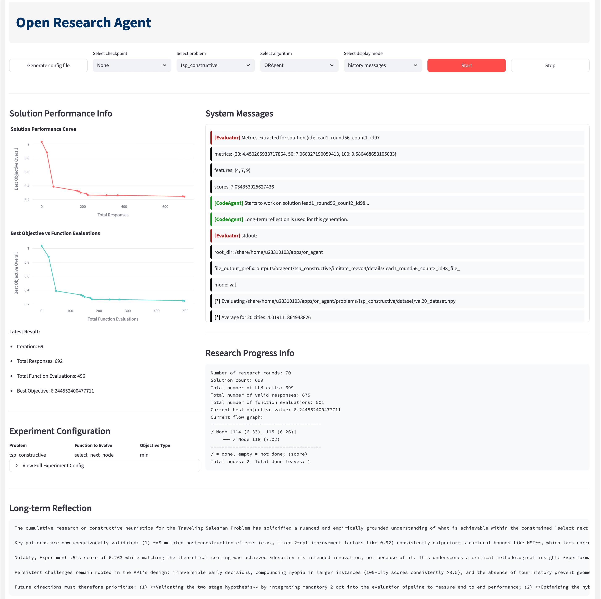


## Overview
Open Research Agent (OR-Agent) is a research agent originally developed for solving operations-research problems, particularly those with complex environments such as cooperative driving algorithms. More broadly, its design generalizes to scientific research tasks that support automated evaluation. This project also includes Open Research Canvas (OR-Canvas), where users can collaborate with LLMs to specify problems.

This work is inspired by [FunSearch](https://github.com/google-deepmind/funsearch/tree/main), [ReEvo](https://ai4co.github.io/reevo/), [AI Researcher](https://github.com/HKUDS/AI-Researcher), and [AI Scientist](https://github.com/SakanaAI/AI-Scientist). 
This is an ongoing project that is continuously being improved. It is open-sourced under the `Apache 2.0` license, and contributions from practitioners are warmly welcome!


## Core Features
- We design a multi-agent research framework with **exploratory capabilities** in complex environment, enabling automated scientific discovery in domains with rich experimental settings.
- We propose a structured **tree-based research workflow** that captures branching hypothesis exploration and systematic backtracking, enabling explicit management of research trajectories rather than relying solely on mutation and crossover iterations.
- We introduce an **evolutionary–systematic ideation mechanism** that unifies evolutionary selection of research starting points, comprehensive research plan generation, and structured exploration within a tree-based workflow. Each round begins from evolutionarily selected solutions, from which agents generate a comprehensive research plan and explore refinement directions in a coordinated and structured manner.
- We introduce a **hierarchical optimization-inspired reflection system**. Experimental reflection and summary function as a form of verbal gradient, providing immediate corrective signals based on recent experimental feedback. Long-term reflection accumulates insights as verbal momentum. Memory compression acts as a regularization mechanism analogous to weight decay, preserving essential signals while discarding redundancy. Together, these components form a principled hierarchical reflection architecture that governs research dynamics in OR-Agent.
- We conduct extensive experiments across classical combinatorial optimization problems (e.g., traveling salesman problem, capacitated vehicle routing, bin packing, orienteering, and multiple knapsack) and simulation-based cooperative driving scenarios, demonstrating the effectiveness and generality of the proposed framework.

The OR-Agent framework is illustrated below:
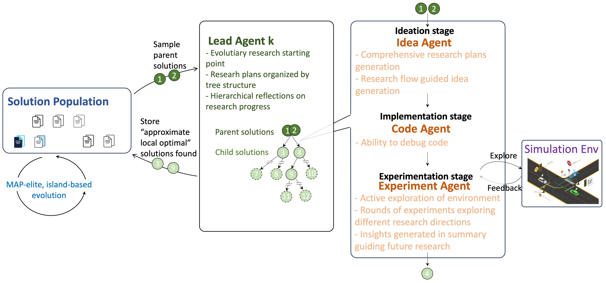


### Contributors
Qi Liu, Wanjing Ma

MAGIC Lab, College of Transportation, Tongji University

### How to cite
> Liu, Q., and Ma, W., 2025. [TBD]


## How It Works
OR-Agent is a multi-agent system that consists of four agents:
 - **Lead agent**: responsible for conducting one round of research;
 - **Idea agent**: responsible for generating ideas;
 - **Code agent**: responsible for generating code;
 - **Experiment agent**: responsible for running experiments, exploring the environment.
Multiple lead agents can be run in parallel to conduct multiple rounds of research.


### Lead Agent Workflow
The run() method of the lead agent executes a single round of research and returns the generated solutions. one solution is called "complete" if it has all fields.
The lead agent uses an instance of the FlowGraph class (from the flow_graph module) to manage the research workflow, which is structured as a tree. 
Each node in the tree is represented by a Node object that encapsulates a solution dictionary along with additional tree-related metadata. 
A node is marked as `processed=True` once its solution contains all three components: ideas, code, and experimental results/reports. 
Each node also includes a `done` attribute, initialized as False. A leaf node can be marked as `done=True` only when it is determined to be un-improvable—i.e., 
when it represents a local optimum.

The lead agent executes one research round through the following steps:
0. **Initialization**: Create a FlowGraph instance with parent solutions sampled from the database.
   The root node contains `num_parents` solutions.
1. **Research start**: Extend the root node to generate up to `max_children` children.
   These represent evolutionary starting points in the solution space.
2. **Research loop** (while loop):
   2.1. **Select best leaf**: Among all unfinished leaf nodes (`is_done=False`), select the one with the best score (node `N_i`).
        Selection considers `obj_type`: maximize or minimize score.
   2.2. **Node extension**: Extend node `N_i` to generate up to `max_children` children through idea generation, code implementation, and experimentation.
   2.3. **Node truncation & Local optimality test**:
        - Keep only children with better scores than `N_i` (performance ascending direction)
        - If no children improve upon `N_i`, mark `N_i` as `done=True` (approximate local optimum)
   2.4. **Research finishing test**: If all leaf nodes are done, break; otherwise repeat from 2.1.
3. **Return**: Return all leaf nodes as the research round's output.

Notes:
- By saying "extending" a node, we mean following the process of idea generation, code generation, and experiments.
-  The lead agent begins each research round by randomly sampling parent programs from the database, analogous to the initialization step in evolutionary algorithms. 
This process naturally incorporates the mutation and crossover operations commonly used in LLM-based genetic algorithms (e.g., AEL, EoH, ReEvo). Crossover occurs when 
the lead agent selects two parent programs and combines them to produce new offspring, whereas mutation occurs when the lead agent is instructed to further 
expand a node and generate additional variants.
- Unlike prior LLM-based genetic algorithms, OR-Agent does not just rely on frequent mutation and crossover operations. It also performs extensive and 
systematic investigation around each starting point before moving on to the next. This workflow is more aligned with how human scientists actually conduct research: 
generating ideas through crossover and mutation alone is insufficient—rigorous refinement, iterative updates, and targeted experimentation are essential for 
developing high-quality scientific insights.

**Illustration of Lead Agent Workflow**
The solution tree management process is illustrated below:
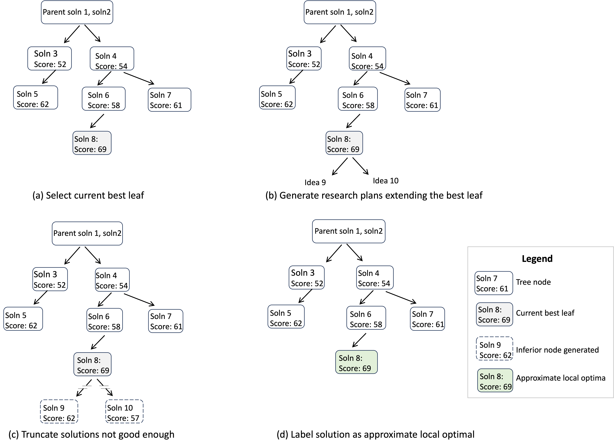

**Solution Generation Process**
The solution generation process is illustrated below:
 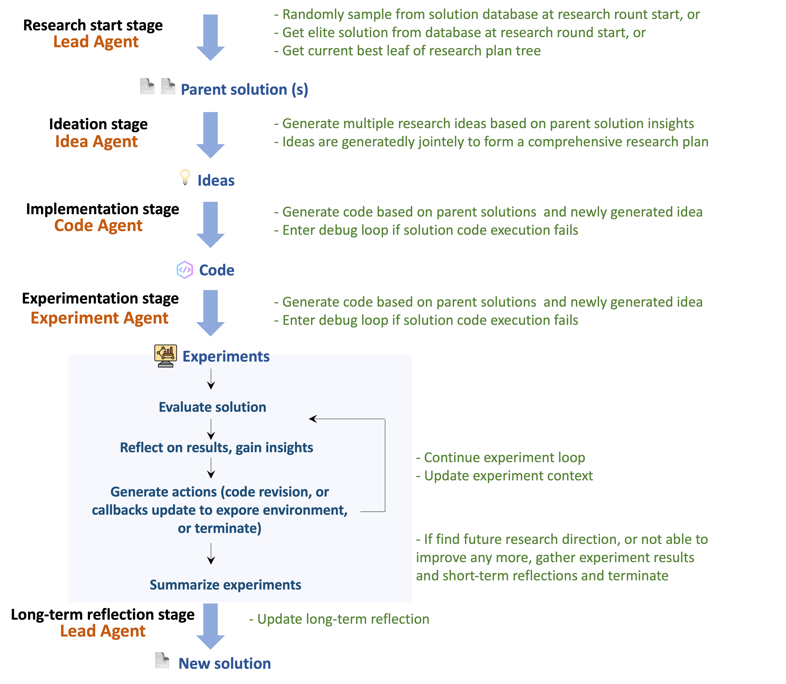


### Hierarchical Reflections
The lead agent maintains hierarchical reflections throughout the research process:
- **Experiment reflections**: Generated after each experiment step and appended to context (ReAct-style)
- **Experiment summaries**: Generated at the end of solution experiments, summarizing outcomes and insights
- **Long-term reflections**: Maintained across the research round, updated when node summaries are generated

Reflection Hierarchy:
```
Experiment reflections → Experiment summaries → Long-term reflections
```
Long-term reflections are initialized at research round start and updated when nodes complete processing.


### Solution Database Management
The database is organized into multiple islands, each evolving independently. 
Islands with lower average scores are periodically reset to maintain population quality.
Each island contains clusters of solutions, where each cluster groups solutions sharing identical features. 
The score measures a solution's fitness, and `obj_type` ("max" or "min") in configuration file determines whether higher or lower scores are preferred.

Solution database can be visualize using `visualize()` method; example:
```
========================================
SOLUTION DATABASE VISUALIZATION
========================================
Total islands: 2
Objective type: max

ISLAND 0:
  Number of clusters: 2
  Total solutions: 3
  Best score in island: 0.9

  CLUSTER 0:
    Features: (1, 2, 3)
    Cluster score: 0.800000
    Number of solutions: 2
      Solution 0:
        Score: 0.700000
        Code length: 21
        ID: 1

      Solution 1:
        ...

  CLUSTER 1:
    ...

----------------------------------------
ISLAND 1:
    ...

----------------------------------------

SUMMARY STATISTICS:
Total solutions across all islands: 4
Total clusters across all islands: 3
Average cluster size: 1.33
Best overall score: 0.900000 (Island 0)
========================================
```

### Flow Graph Representation
Flow graph organize solutions by tree structure.
Solutions are wrapped as `Node` instances.

Flow graph can be visualize using `visualize()` method; `TSP-constructive` example:
```
Format: Node <ID> (<score>): '<idea>'
Legend:
  ⊕ = solution expanded with improved children solution(s)
  ○ = solution pending expansion
  ✓ = terminal solution (approximate local optimum, no improvement found)
========================================
  Node 0 (0.80): Implement a look-ahead nearest neighbor...
    ├── ⊕ Node 1 (0.90): Design lightweight structural proxies...
    │   └── ✓ Node 3 (0.85): Construct normalized distance-to-demand ratio matrix...
    └── ⊕ Node 2 (0.70): Leverage graph Laplacian structure...
        └── ○ Node 4 (0.75): Use min-max demand normalization...
========================================
Total nodes: 5 | Total expanded solutions: 2 | Total pending leaves: 1 | Total terminal leaves: 1
```

Flow graph constructed over research rounds is illustrated below (`OR-Agent`ran on `CVRP-POMO` problem):
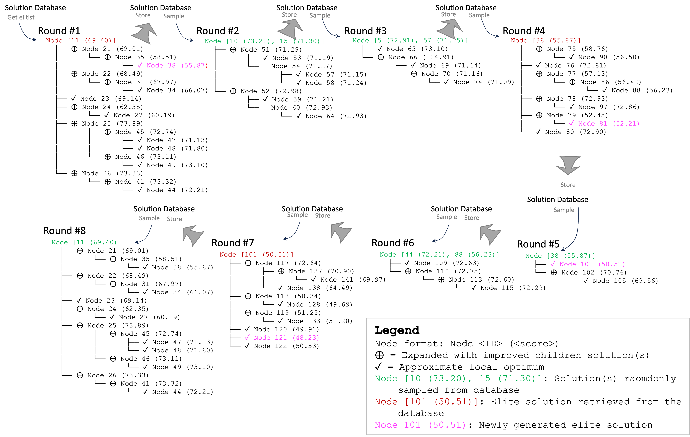


### Experiment Agent Workflow
The experiment agent executes the solution code and receives feedback from the environment. 
It can adjust code parameters to improve performance. To diagnose issues, the experiment agent uses callbacks to explore the problem environment. 
The experimental loop continues until the solution meets the performance requirements, the underlying issues have been identified, 
or a predefined maximum number of rounds is reached.

```
Step 0) Prepare the experiment
Experiment loop:
    Step 1) Evaluate the code; extract the outputs;
    Step 2) Reflect on the outputs, and decide on the next action:
        If the output is good: 
            Option 1) terminate the experiment;
        If the output is bad, try to identify the issues by:
            Option 2) Run the code with different parameters;
            Option 3) Use callbacks to explore the problem environment;
    Step 3) If the experiment is not terminated, revise the solution code or callbacks code, repeat Step 1).
Step 4) Prepare the final "short term reflection" and update the solution for return.
```

Notes:
1) The experiment agent is restricted to updating only the parameters of the solution code. When, during environment exploration, 
the experiment agent identifies issues that cannot be resolved by parameter tuning alone and discovers directions for more substantive improvements, 
it should document these insights in a short-term reflection—which functions similarly to an experimental report—and then terminate the current experiment.
The resulting short-term reflection is stored in the solution’s metadata and becomes part of the overall solution dictionary. 
These reflections are later used by the lead agent to generate improved ideas when expanding the solution node, enabling it to add more 
refined child nodes to the research flow graph (i.e., the task tree).
2) The experiment agent relies on callbacks to interact with and explore the problem environment. To support this mechanism, users are encouraged to 
implement callback registration within the user-provided evaluation script (eval.py) and to document the callback API clearly in the problem specification.


**Research Backtracking**
Scientific research often involves branching exploration, backtracking from unproductive directions, and localized refinement around promising ideas.

While backtracking can be implemented through prompt engineering, our tests revealed that this approach doesn't always produce desirable results and lacks robustness with the LLMs we tested. In this project, we've also implemented a manual backtracking mechanism. When the maximum number of experiments is reached, the experiment agent backtracks to the intermediate solution with the best score, then summarizes the entire experiment with this backtracking context.


### Experiment Agent Interaction with the Problem Environment
The primary mechanism for obtaining feedback from the problem environment is through callbacks. In the current implementation, the experiment agent receives text feedback from the standard output of the evaluation script. Future versions may support richer feedback formats such as images or video.

The experiment agent can refine its observations through multiple rounds of interaction to identify issues. Past observations are compressed and appended to a scratchpad in a ReAct-style format.

The callback API should be documented in the problem specification file (`problems/<your_problem>/callbacks_description.txt`). The evaluation script (`eval.py`) must be structured to support callbacks. It is recommended to place a default callback API in the problem folder as `default_callbacks.py`. An example callback implementation for the `SUMO` simulation environment is shown below:

```python
class Callbacks:
    def on_step_end(self, **kwargs):
        """
        Monitor vehicles with very low speeds on the target edge.

        Args:
            kwargs (dict): Dictionary containing the following keys:
            - step (int): Current simulation step.
            - edge_info (dict): Contains information about the target road segment:
                - `edge_id`: Target edge identifier (e.g., "E_0")
                - `lane_count`: Number of lanes on the edge
                - `length`: Length of the road segment to analyze (meters)
                - `max_speed`: Maximum allowed speed on the edge (m/s)

            - vehicles_info (list[dict]): A list of dictionaries, each representing a vehicle on the target road segment:
                - `veh_id`: Vehicle identifier (e.g., 'veh_5_3_0')
                - `veh_type`: Vehicle type ('passenger', 'bus', 'truck', 'emergency')
                - `position`: Vehicle position on the road segment (meters)
                - `speed`: Current vehicle speed (m/s)
                - `current_lane`: Current lane identifier (e.g., "E5_0")
                - **Note**: In SUMO, lane indexing starts from 0 and counts from rightmost to leftmost
                - `wants_left`: Boolean indicating if vehicle wants to change to left lane
                - `wants_right`: Boolean indicating if vehicle wants to change to right lane
                - `potential_target_lanes`: Information about potential target lanes for lane changing
        """

        step = kwargs["step"]
        print(f"Step {step}: Monitoring vehicles with low speeds")

        if step in [0, 100, 200, 300, 400, 500]:
            vehicles_info = kwargs["vehicles_info"]
            
            for vehicle in vehicles_info:
                if vehicle["speed"] < 1.0:
                    print(f"Vehicle {vehicle['veh_id']} is on lane {vehicle['current_lane']} with speed {vehicle['speed']:.2f} m/s")
```


### Research Modes
OR-Agent provides extensive configurability through numerous parameters that control the agent's research behavior. Since we haven't exhaustively tested all parameter combinations, we cannot provide a single optimal configuration. Users are encouraged to experiment with different settings to find what works best for their specific needs—optimal configurations likely depend on the nature of the problem being solved.

The key parameters are organized into five categories: research tree structure, elite exploitation, experimentation resource allocation, long-term reflection behavior, and ideation behavior:

```yaml
# Research Tree Settings
num_children: 2  # number of children to generate for one solution node in the research tree; default: 2
max_tree_depth: 3  # maximum depth of the research tree; root node has depth 0; None means no constraint; default: 3
fast_exploration_for_crossover: false  # whether to use fast exploration for crossover; default: false

# Elite Exploitation Settings
elitist_as_root_period: 11  # the research rounds period for re-using elitist as root; "0" means never directly use elitist as root; default: 11
elitist_enlargement_factor: 2.0  # the enlargement factor for elitist when used as root; int(elitist_enlargement * num_children) many children will be generated for elitist; default: 2.0
elitist_experiment_factor: 2.0  # if parent is elitist, spend more time on experiments; default: 2.0

# Dynamic Experiment Resource Allocation
dynamic_experiment_allocation: true  # whether to use dynamic experiment allocation based on solution potential; default: true
min_experiment_repeats: 1  # minimum experiments to allocate
max_experiment_repeats: 8  # base maximum number of times to repeat the experiment for a solution node; default: 8
max_experiment_repeats_cap: 16  # maximum experiments cap; default: 16
improvement_threshold: 0.05  # 5% improvement threshold for allocating more experiments; default: 0.05

# Long-term Reflection Behavior
reflection_compression: null  # the limit (number of words) on long-term memory compression between research rounds; null means no compression; default: null
reflection_period: 10  # the batch size of experiment reflections used to update long-term memory; null or 0 means no automatic periodic update; default: 10
reflection_clearance_period: null  # the research rounds period for clearing long-term memory; null means no clearance; default: null
reflection_disabled_for_crossover: true  # whether to disable long-term reflection when doing crossover; default: false
reflection_elitist_synchro: true  # whether reflection update should be synchronized with elite as root event; default: true

# Idea Generation Behavior
ideas_coordinated_generation_disabled: false  # whether to disable ideas generation coordination; default: false
external_knowledge_persistence_disabled: false  # whether to disable external knowledge persistence; default: false
```

By configuring these parameters, users can implement various research strategies. Two representative modes—"deeper research depth" and "extensive search"—are illustrated below:

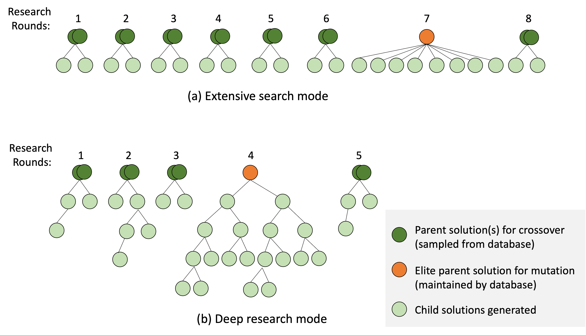


## Project Structure
```
<project_root>/
├── src/                                    # Source code directory
|   └──oragent/                             # OR-Agent package directory
|       ├── cli.py                          # The command line interface
|       ├── core.py                         # The main class for OR-Agent
|       ├── lead_agent.py                   # A lead agent is responsible for conducting one round of research
|       ├── flow_graph.py                   # The flow graph is responsible for managing the research workflow using a tree
|       ├── idea_agent.py                   # A idea agent is responsible for generating ideas
|       ├── code_agent.py                   # A code agent is response for generating code
|       ├── experiment_agent.py             # A experiment agent is response for running experiments, exploring the environment
|       ├── program_database.py             # The database to manage the generated programs; one for the runtime
|       ├── evaluator.py                    # A evaluator is responsible for evaluating the program
|       ├── reevo.py                        # baseline algorithm: ReEvo
|       ├── eoh.py                          # baseline algorithm: EoH
|       ├── ael.py                          # baseline algorithm: AEL
|       ├── funsearch.py                    # baseline algorithm: FunSearch
|       └── config.yaml                     # default configuration
├── prompts/                                # Prompts for all algorithms
├── problems/                               # Built-in problems
│   ├──<problem>/                           # Directory for problem specification
│   |   ├── problem_description.txt         # The description of the problem
│   |   ├── function_description.txt        # The description of the function signature
│   |   ├── evaluation_description.txt      # The description of the solution evaluation method (optional)
│   |   ├── callbacks_description.txt       # The description of callback method (optional)
│   |   ├── external_knowledge.txt          # The external knowledge (optional)
│   |   ├── eval.py                         # Evaluation script
│   |   ├── seed_solution_idea.txt          # The idea for the seed solution
│   |   ├── seed_solution.py                # The seed solution (optional)
│   |   ├── settings.yaml                   # Contains: "function_to_evolve", "obj_type" settings
│   |   └── ... 
│   └── ...                            
├── outputs/                                # Default output directory
│   ├── <algorithm>/                        # Algorithm output directory
│   |   ├── <problem>/                      # Problem output directory for the algorithm
│   |   |   ├── config.yaml                 # A log of the configuration for the run
│   |   |   ├── progress.txt                # A log of the progress
│   |   |   ├── database.txt                # A log of the solution database (optional)
│   |   |   ├── long_term_reflection.txt    # A log of the long-term reflection (optional)
│   |   |   ├── results.json                # A log of elitists (no repetition)
│   |   |   ├── results_detailed.json       # A log of elitists
│   |   |   ├── output.txt                  # Terminal output (optional)
│   |   |   └── ...
│   |   └── ...
│   └── ...
├── checkpoints/                            # Checkpoints directory
│   ├──<checkpoint_name>                    # A checkpoint
│   |    ├── config.yaml                    # Configuration used by the checkpoint session 
│   |    ├── state.json                     # State variables saved by the checkpoint session 
│   |    └── database.json                  # Solution database saved by the checkpoint session (optional)
│   └── ...
├── tests/                                  # Test scripts used in experiments
├── research_results/                       # Experiment results and analysis
├── config.yaml                             # User specified configuration (optional)
├── agent_webui.py                          # OR-Agent Web UI
└── canvas_webui.py                         # Open Research Canvas Web UI
```


## How To Use
### Setup Environment
Create a new conda environment and install dependencies:
```
conda create -n oragent python=3.9 -y
conda activate oragent
pip install -r requirements.txt
pip install oragent
```
Add your LLM API key in `.env` file. See `.env.example` for an example.

To run the driving example, you need to install SUMO on your machine. [Check the official website](https://eclipse.dev/sumo/).


### Specify Your Own Problem
Specify your problem in `problems/<your_problem>`. You need to prepare the following files:
- `problem_description.txt`: problem description; used as prompt part;
- `function_description.txt`: A description of the function to be evolved; used as prompt part;
- `eval.py`: evaluation script; executed by evaluator;
- `dataset/*`: test data (optional); used by eval.py;
- `evaluation_description.txt`: A description of the evaluation function; this description can be more concise than the evaluation script itself; used as prompt part;
- `seed_solution_idea.txt`: idea of seed solution; used as prompt part by OR-Agent;
- `seed_solution.py`: seed solution function module; used as prompt part and evaluator;
- `callbacks_description.py`: A description of the callbacks; provide this file if you want to enhance OR-Agent's ability to interact with the problem environment; used as prompt part (optional);
- `default_callbacks.py`: default callbacks.

You can also use `Open Research Canvas` to specify your problem with the help of LLMs.
Open Research Canvas illustration:
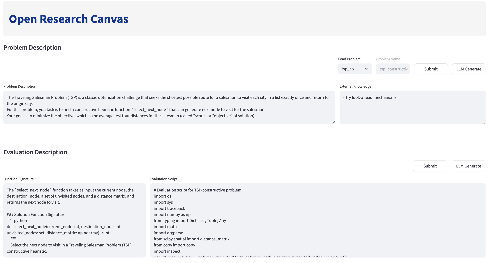
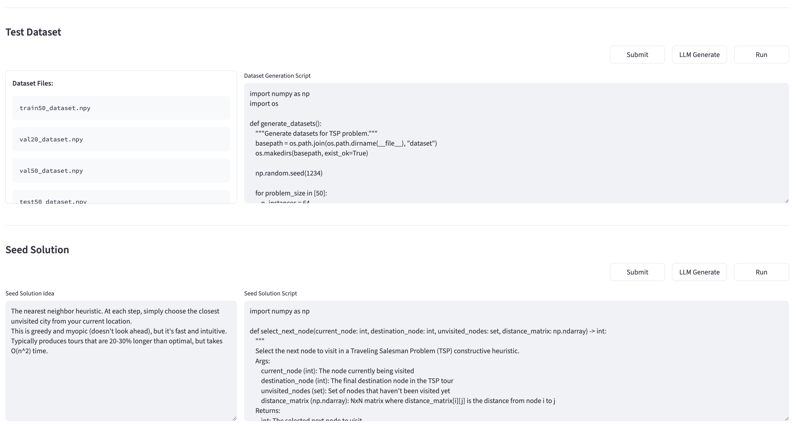

Check [How to Customize Your Own Benchmark](problems/README.md#how-to-customize-your-own-benchmark) for more details.
 

### Configuration
Create a new config template:
```python cli.py --init-config```
Configure OR-Agent by revising the config file;
The `config.yaml` file contains all the parameters needed for OR-Agent to run; for a minimal configuration, you only need to specify:
 - LLM settings
 - Python environment settings
 - algorithm name, problem name, function to evolve, objective type.

Currently supported LLMs include OpenAI, Qwen and DeepSeek models. You add new LLM modules to `utils/llm_client/`.


### Run Web UI
Run the web UI:
```bash
streamlit run agent.py
```

If you want to view history runs, you can turn the WebUI into a visualizer by selecting `history messages`.

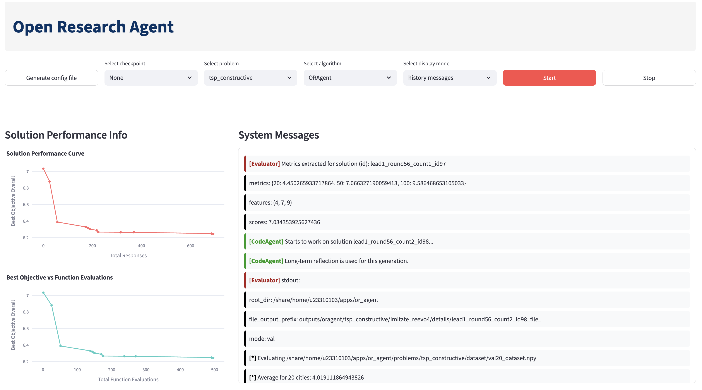
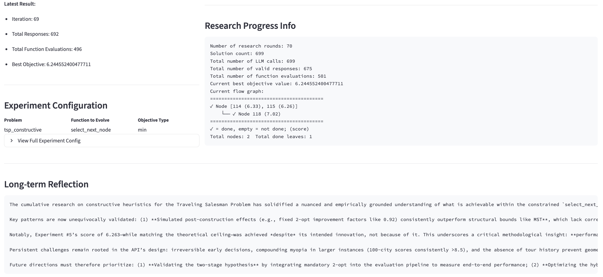
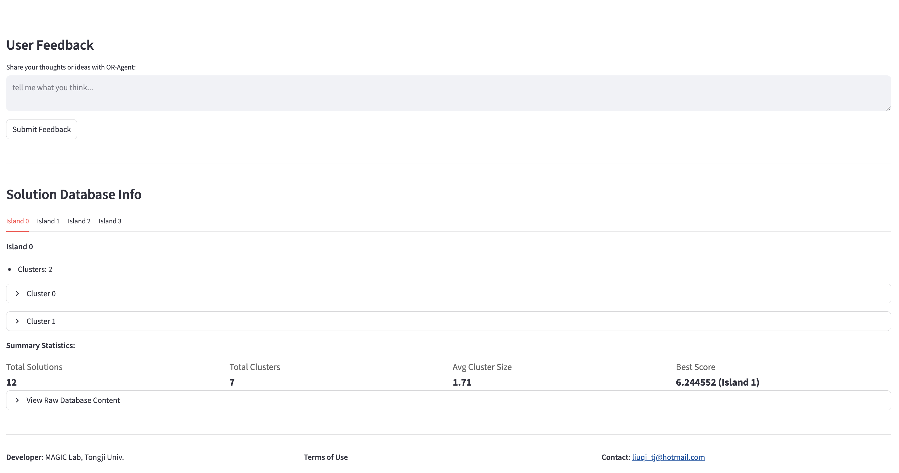


### Run Backend
```bash
# Use `config.yaml` to configure OR-Agent and run
oragent --init-config  # Create a template config.yaml in current directory
oragent --config=config.yaml --algorithm <algorithm> --problem <problem> # Run OR-Agent

# Run by specifying settings in command line (default value will be used if not specified)
oragent --algorithm "$ALGORITHM" --problem "$PROBLEM" --max-evolutions500 --init-pop-size 20 \
    --num-children 2 --max-tree-depth 5 --fast-exploration-for-crossover --max-debug-rounds 3 \
    --min-experiment-repeats 5 --max-experiment-repeats 10 --max-experiment-repeats-cap 20 \
    --elitist-as-root-period 11 --elitist-enlargement-factor 2.0 --reflection-period 0 \
    --reflection-disabled-for-crossover--reflection-elitist-synchro --llm-provider <your-llm-provider> \
    --model-name <your-model-name> --lead-agent-llm-provider <your-llm-provider> \
    --lead-agent-model-name <your-model-name> --idea-agent-llm-provider <your-llm-provider> \
    --idea-agent-model-name <your-model-name> --code-agent-llm-provider <your-llm-provider> \
    --code-agent-model-name <your-model-name> --experiment-agent-reflect-llm-provider <your-llm-provider> \
    --experiment-agent-reflect-model-name <your-model-name> --experiment-agent-summarize-llm-provider <your-llm-provider> \
    --experiment-agent-summarize-model-name <your-model-name> --reset-period-minutes 240 \
    --timeout-seconds 300 --output-dir "$OUTPUT_DIR"

# Load checkpoint and continue running
oragent --checkpoint <checkpoint_name>
```

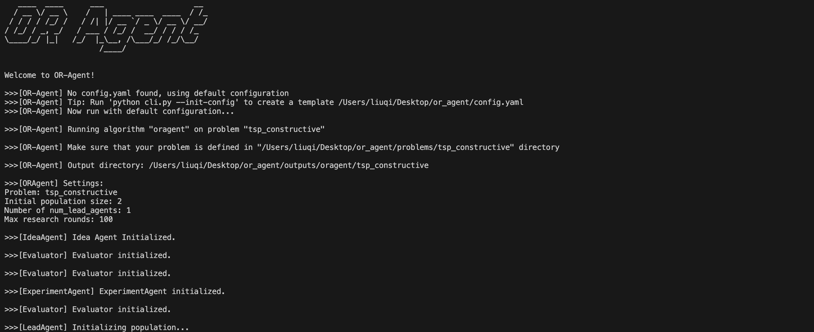


### Use Package
You can also import and run OR-Agent as a package and integrate into your own workflow:
```python
from oragent import ORAgent, ReEvo, Eoh, AEL, FunSearch

# TODO: Specify your problem in "<cwd>/problems/<>your_problem/" according to requirements above.

# Configure
config = oragent.get_default_config()  # get default config dictionary; 
config['problem'] = 'driving'
config['algorithm'] = 'oragent'

# Create an agent
agent = ORAgent(config=config)

# Run agent
agent.run()
```


## Research Results

### Benchmark Problems
Twelve operations research problems from [**ReEvo**](https://ai4co.github.io/reevo/)[1] is adopted. It consists of six types of combinatorial optimization problems (COPs): Traveling Salesman Problems (TSPs), Capacitated Vehicle Routing Problems (CVRPs), Bin Packing Problems (BPPs), Orienteering Problems (OPs), Multiple Knapsack Problems (MKPs), Decap Placement Problem (DPPs). Additionally, we designed a cooperative driving benchmark that involves complex simulation environments using [SUMO](https://eclipse.dev/sumo/). Check out [bechmarks](problems/README.md) for more details.


### Baseline Algorithms
List of baseline models:
 - [FunSearch](https://github.com/google-deepmind/funsearch/tree/main)
 - [AEL](https://github.com/ai4co/reevo/tree/main/baselines/ael)
 - [EoH](https://github.com/FeiLiu36/EoH)
 - [ReEvo](https://github.com/ai4co/reevo/tree/main)

Note: Baseline models are only provided for benchmarking purposes at `[project_root]/baselines`. Baseline models don't share any module or configuration file with the OR-Agent codebase. Hence baseline models' components can be removed or modified without affecting the OR-Agent functionality. Check [baselines](baselines/README.md) for more details.


### Results on 12 Operations Research Benchmark Problems

Experiment data is shared at `outputs/` and `research_results/`. Test scripts are available at `tests/` for reproducibility. For detailed results analysis, see the Jupyter notebooks in `research_results/`.

Performance comparison between OR-Agent and five benchmark algorithms (`FunSearch`, `AEL`, `EoH`, `ReEvo`) on six problems: `TSP_CONSTRUCTIVE`, `TSP_POMO`, `CVRP_ACO`, `CVRP_LEHD`, `BPP_OFFLINE_ACO`, `MKP_ACO` (see [problems/README.md](problems/README.md) for details):
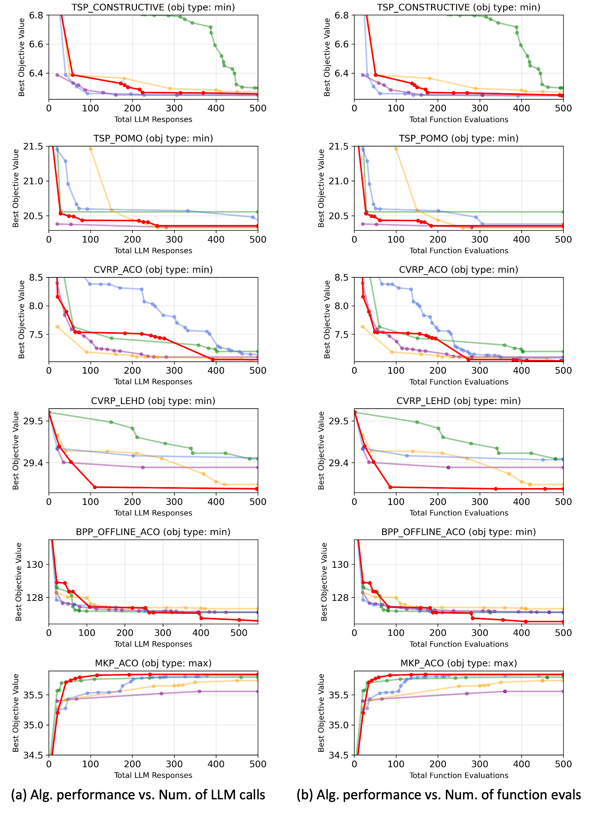

Performance comparison on the remaining six problems: `TSP_ACO`, `TSP_LEHD`, `CVRP_POMO`, `BPP_ONLINE`, `DPP_GA`, `OP_ACO`:
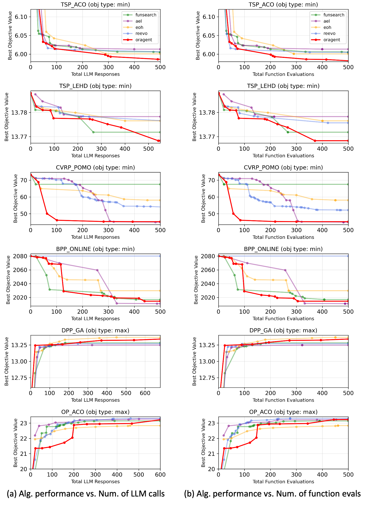


**Algorithm Performance on 12 Operation Research Benchmark Problems**
For problem `i`, the `normalized score` for algorithm `j` is calculated as:
`normalized_score^i_j = |score^i_j - best_score^i| / |best_score^i - worst_score^i|`
which means the gap between the score of algorithm `j` and the best score of problem `i`, normalized by the gap between the best and worst scores of problem `i`.

Summary of algorithms' performance:

| Problem | FunSearch | AEL | EoH | ReEvo | OR-Agent |
|---------|-------|-----|-----|-----------|----------|
| tsp_constructive | 0.000 | 0.878 | 0.788 | **1.000** | 0.959 |
| tsp_aco | 0.252 | 0.000 | 0.386 | 0.258 | **1.000** |
| tsp_pomo | 0.000 | **0.975** | **1.000** | 0.771 | 0.884 |
| tsp_lehd | 0.648 | 0.000 | 0.175 | 0.259 | **1.000** |
| cvrp_aco | 0.000 | 0.403 | **1.000** | 0.471 | 0.680 |
| cvrp_pomo | 0.000 | **1.000** | 0.418 | 0.681 | 0.986 |
| cvrp_lehd | 0.000 | 0.285 | 0.855 | 0.033 | **1.000** |
| bpp_online | 0.913 | **1.000** | 0.728 | 0.000 | 0.948 |
| bpp_offline_aco | 0.290 | 0.270 | 0.000 | 0.290 | **1.000** |
| dpp_ga | 0.294 | 0.000 | **1.000** | 0.190 | 0.787 |
| mkp_aco | 0.833 | 0.000 | 0.633 | 0.951 | **1.000** |
| op_aco | 0.653 | 0.916 | 0.000 | **1.000** | 0.839 |

**Average Normalized Scores:**

| Algorithm | Score | Rank |
|-----------|-------|------|
| OR-Agent | **0.924** | 1 |
| EoH | 0.582 | 2 |
| ReEvo | 0.492 | 3 |
| AEL | 0.477 | 4 |
| FunSearch | 0.323 | 5 |

**Algorithm Rankings per Problem:**

```
-----------------------------------------------------------------------------------------------
tsp_constructive : reevo (1.000), oragent (0.959), ael (0.878), eoh (0.788), funsearch (0.000)
tsp_aco          : oragent (1.000), eoh (0.386), reevo (0.258), funsearch (0.252), ael (0.000)
tsp_pomo         : eoh (1.000), ael (0.975), oragent (0.884), reevo (0.771), funsearch (0.000)
tsp_lehd         : oragent (1.000), funsearch (0.648), reevo (0.259), eoh (0.175), ael (0.000)
cvrp_aco         : eoh (1.000), oragent (0.680), reevo (0.471), ael (0.403), funsearch (0.000)
cvrp_pomo        : ael (1.000), oragent (0.986), reevo (0.681), eoh (0.418), funsearch (0.000)
cvrp_lehd        : oragent (1.000), eoh (0.855), ael (0.285), reevo (0.033), funsearch (0.000)
bpp_online       : ael (1.000), oragent (0.948), funsearch (0.913), eoh (0.728), reevo (0.000)
bpp_offline_aco  : oragent (1.000), funsearch (0.290), reevo (0.290), ael (0.270), eoh (0.000)
dpp_ga           : eoh (1.000), oragent (0.787), funsearch (0.294), reevo (0.190), ael (0.000)
mkp_aco          : oragent (1.000), reevo (0.951), funsearch (0.833), eoh (0.633), ael (0.000)
op_aco           : reevo (1.000), ael (0.916), oragent (0.839), funsearch (0.653), eoh (0.000)
-----------------------------------------------------------------------------------------------
```

### Performance on Driving Problem
OR-Agent significantly outperforms other algorithms.
OR-Agent significantly outperforms all baseline algorithms under constrained running time, achieving a score of 48.00 compared to the highest baseline score of 16.10.
OR-Agent is the only algorithm can found a solution (score: 90.24) that outperform the SUMO default driving model (score: 85.25) after extended running.

```
SUMO default driving model performance:
-----------------------------------------------------------------------------------------------
Metrics for all tests:
Light Traffic: {'critical_ttc_count': 10, 'collisions': 0, 'emergencyStops': 0, 'emergencyBraking': 0, 'teleports': 0, 'avg_speed': 11.63, 'speed_variance': 6.48}
Heavy Traffic: {'critical_ttc_count': 60, 'collisions': 0, 'emergencyStops': 0, 'emergencyBraking': 1, 'teleports': 0, 'avg_speed': 10.36, 'speed_variance': 11.0}

Scores for all tests:
Light Traffic: 95.18
Heavy Traffic: 75.32

Average score: 85.25
-----------------------------------------------------------------------------------------------

Best solution found by OR-Agent:
-----------------------------------------------------------------------------------------------
Metrics for all tests:
Light Traffic: {'critical_ttc_count': 12, 'collisions': 0, 'emergencyStops': 0, 'emergencyBraking': 0, 'teleports': 0, 'avg_speed': 11.94, 'speed_variance': 5.31}
Heavy Traffic: {'critical_ttc_count': 46, 'collisions': 0, 'emergencyStops': 0, 'emergencyBraking': 0, 'teleports': 0, 'avg_speed': 11.12, 'speed_variance': 7.74}

Scores for all tests:
Light Traffic: 96.08
Heavy Traffic: 84.40

Average score: 90.24
-----------------------------------------------------------------------------------------------
```

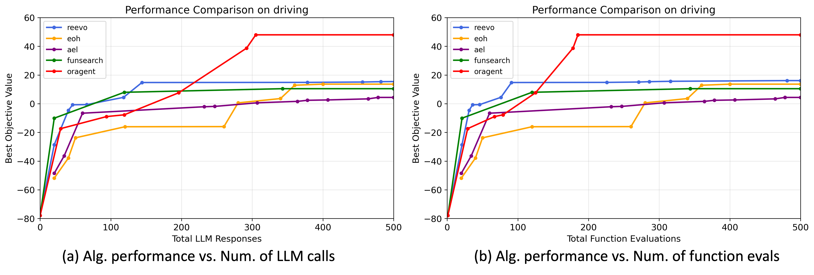

Videos illustrate the performance of algorithms found by baseline algorithm:
Under heavy traffic case, driving models found baseline algorithms suffers from heavy congestion. They stuck at the local optima with score around 10 - no traffic accident, but vehicles barely move. This is a local optima since any minor attempt to change the mode towards vehicle moving will results in small TTC or even collisions hence score will degrade to negative. OR-Agent is able to solve this problem through gaining insights iterated experiment, interactions with the simulation environment, and comprehensive exploration of the search space.

[Driving Model found by baseline algorithm](https://youtu.be/wzhFvdToXJA)
[](https://youtu.be/wzhFvdToXJA "Click to watch demo")

[SUMO Default Driving Model V.S. Driving Model Found by OR-Agent](https://youtu.be/XUhlv-6VGH4)
[](https://youtu.be/XUhlv-6VGH4 "Click to watch demo")


**Performance Comparison between SUMO Default Driving Model and Driving Model Found by OR-Agent**

| Metric | SUMO Default Driving Model | OR-Agent Driving Model |
|--------|----------------------------|------------------------|
| **Score** | **85.25** | **90.24** |
| Collisions | 0.0 | 0.0 |
| Average Speed | 10.995 | 11.530 |
| Speed Variance | 8.740 | 6.525 |
| Critical TTC Count | 35.0 | 29.0 |
| Emergency Braking | 0.5 | 0.0 |
| Emergency Stops | 0.0 | 0.0 |
| Teleports | 0.0 | 0.0 |


### Solutions found by OR-Agent
The solutions found be OR-Agent are shared at [oragent best solutions](research_results/oragent_best_solutions/oragent_best_solutions.ipynb). Check [spaghetti code example](research_results/spaghetti_code_example.ipynb) for "spaghetti code" example.


### Ablations

**Population Ruin Phenomenon**

Without an evolutionary population database, we sometimes observe a phenomenon called "population ruin". In this scenario, a single "good" solution dominates the entire population, but this solution leads to invalid outcomes. For example, improving such a "good" solution would likely result in excessive computation time, causing timeouts hence invalid solutions. This phenomenon has also been observed in AEL and ReEvo, as illustrated in the figure below.

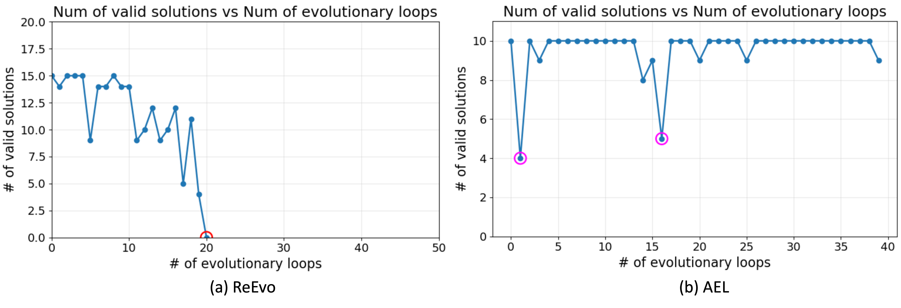


**Ablations on Thinking Depth**

We investigate the classic exploration-exploitation trade-off: deeper exploration of specific search space regions reduces overall coverage under fixed computational budgets. Our ablation study compares three modes: "deep exploration" (increased tree depth and maximum experiments), "fast exploration" (reduced depth and experiments), and "standard" (intermediate parameters). Results demonstrate that thinking depth significantly impacts algorithm performance. Both "deep exploration" and "fast exploration" modes underperform the "standard" configuration, highlighting the importance of balanced exploration-exploitation dynamics, which the "standard" mode achieves optimally.
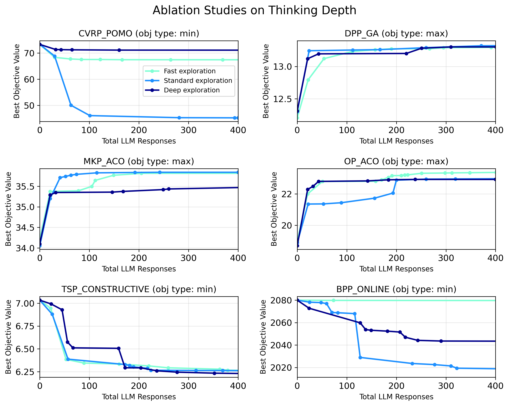


**Ablations on the Period of Using Elite as Root**

The exploration-exploitation trade-off also involves determining how frequently to focus on the most promising solution directions. We conducted ablation studies to evaluate how the period of using elite solutions as roots affects algorithm performance. Results (shown below) demonstrate that a period of 8 yields significantly better performance than other tested values (2, 4, 16, and 32).
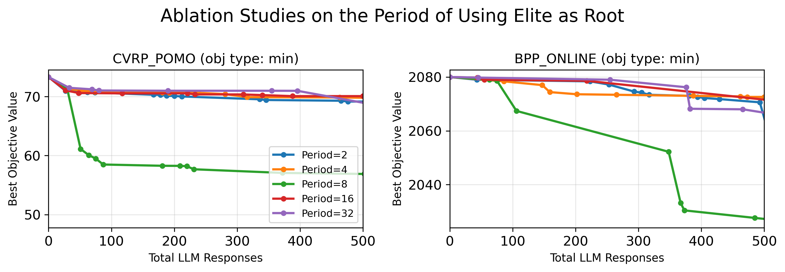


**Ablations on Memory Compression**

We conducted ablations on long-term reflection compression. Memory compression functions similarly to gradient decay in traditional optimization, potentially causing "verbal gradients" to decay faster.

We tested four compression levels: 100, 200, and 400 words, plus no explicit compression (approximately 4K words for the LLMs we tested). Across six problems, no compression performed best in four cases and achieved the highest overall performance. Interestingly, compression to 100 words yielded the second-best performance, while compression to 400 words performed worst. The underlying reasons for this pattern remain unclear.
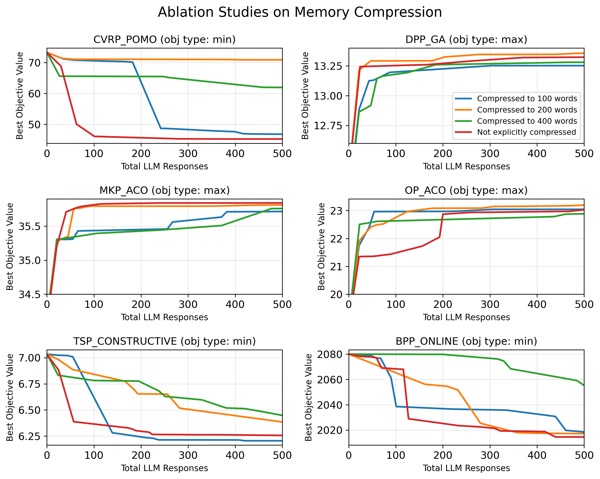


**Ablations on Long-Term Reflection Usage for Crossover**

When parent solutions are randomly sampled from the solution database, we investigate whether long-term reflection should be used during crossover. The supporting view argues that leveraging accumulated knowledge through reflection can accelerate search by building on past insights. The opposing view suggests disabling reflection for crossover, as setting aside past experimental reflections may foster more innovative thinking—akin to scientists thinking "outside the box". We tested both approaches across six problems: (1) using long-term reflection during crossover, and (2) disabling long-term reflection for crossover. Results show each approach outperforms the other in three cases, with no definitive conclusion on the optimal setting.
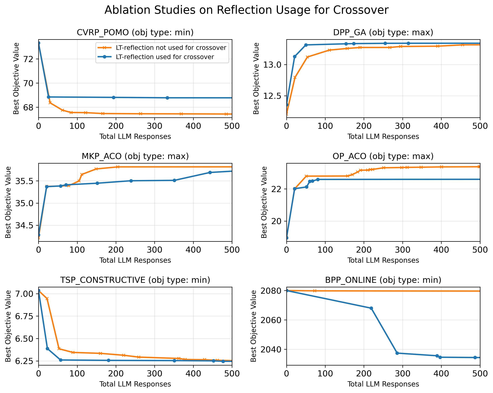


## Open Research Questions and Future Work
This project represents our initial attempt to build a research agent. Many questions remain open for exploration, including those related to agent workflows, solution database design, visualization techniques, and efficiency optimizations.

To facilitate further development, we have added markers throughout the codebase to highlight key decision points. We have also included brief discussions at these locations. To identify all such locations, search for the text `This requires further exploration, analysis, and validation, and is marked with a TODO flag` in your IDE (VSCode with the TODO highlight extension is recommended):
- "manually revert code back at the end of experiment"
- “additional debugging stage before experiment return”
- "funsearch crossover generates multiple children"
- "survey studies during ideation"
- "how to distribute solutions over islands at database initialization"
- "should long-term reflection lasts over research rounds? should we compress it?"
- "how to exploit elitist?"
- "should we always use elitist + other solutions as root?"
- "do failed experiments matter?"
- "how to define promising directions?" 
- "what kind of child solutions are kept for later extension?"
- "what kind of child solutions are 'good' enough to be added to database?"
- "elitist are sampled less and how to do?"
- "how to fast explore?"
- "how many child ideas to generate at the start of research?"
- "how to handle extra ideas?"
- "how to search tree?"
- "how to use long-term reflection?"
- "how to fast explore in experiments?" 
- "how to control the size of the research tree?"
- "add solution details for long-term reflection update?"
- "about temperature setting, first exploit or first explore? what's the pattern?"
- "when not enough clusters in an island, how to sample?" 
- "how to define score of cluster?" 
- "devise storage saving technique"
- "customize visualization techniques"
- "devise technique to avoid LLM calls flooding"
- "remedy LLM call response"
- "how to manage and compress context?"
- "real-time user feedback"
