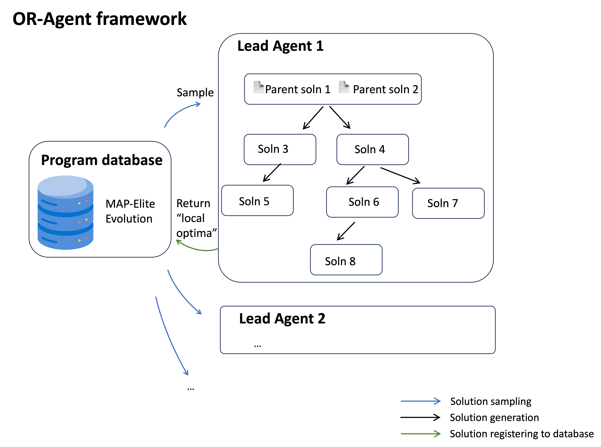
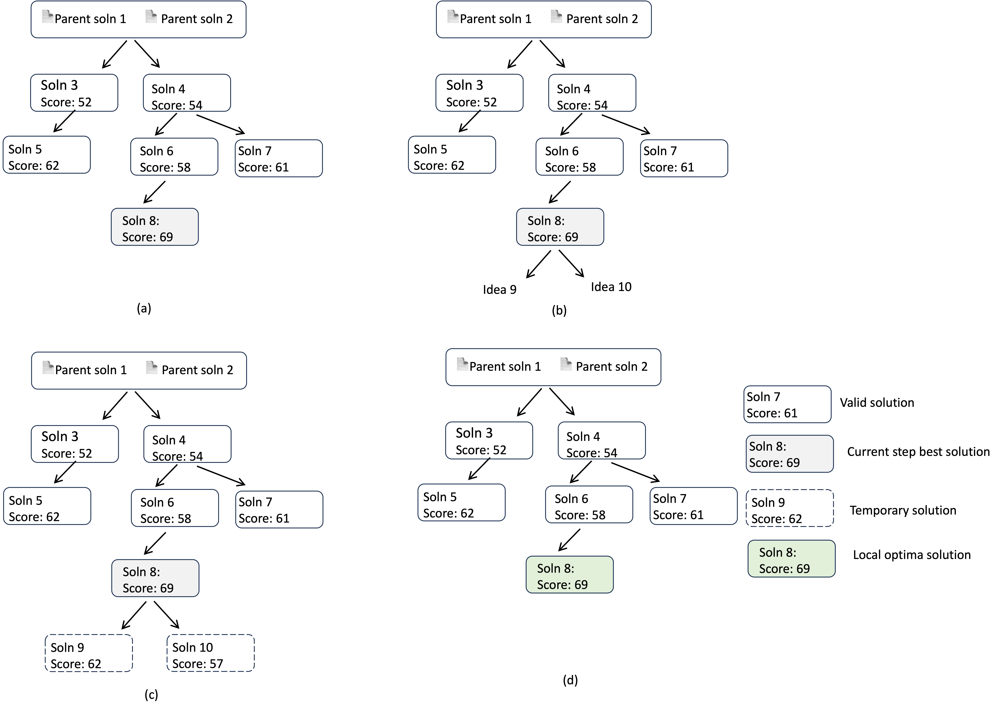
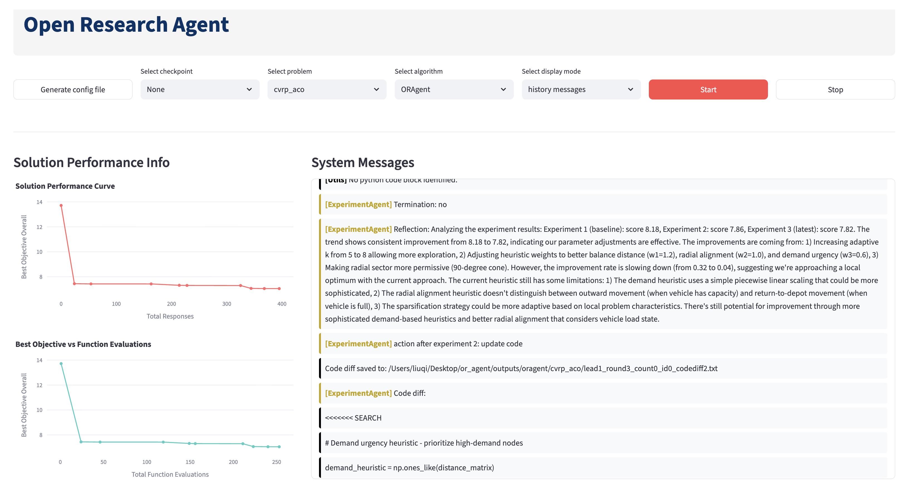
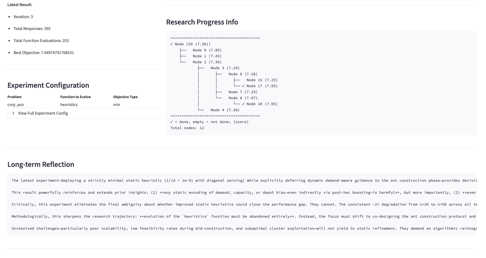
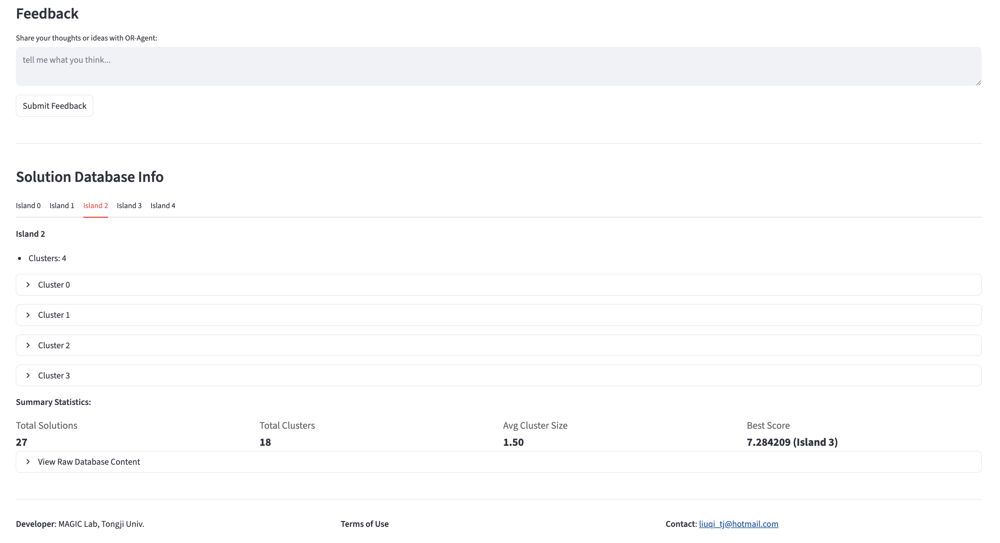

# OR-Agent: Open Research Agent for Operations Research Problems with Complex Environments

## Overview
OR-Agent is a coding-oriented research agent originally developed for operations-research problems in complex environments. More broadly, its design generalizes to fully automated scientific-research tasks. The framework of OR-Agent is illustrated in the following figure:


This work is inspired by [FunSearch](https://github.com/google-deepmind/funsearch/tree/main), [ReEvo](https://ai4co.github.io/reevo/), [AI Researcher](https://github.com/HKUDS/AI-Researcher), and [AI Scientist](https://github.com/SakanaAI/AI-Scientist).

This is an ongoing project that is continuously being improved. It is open-sourced under the `Apache 2.0` license, and contributions from practitioners are warmly welcome!


## Core Features
**Multi-agent research framework**
This study introduces a multi-agent architecture that supports ideation, literature survey, coding, and experimentation. OR-Agent can both search the internet for surveys and explore complex experimental environments—two forms of exploratory capability that are essential for automated scientific discovery.
**Evolutionary ideation**
We incorporate principles from evolutionary algorithms into the research-ideation stage, enabling OR-Agent to explore uncharted problem spaces and generate more innovative hypotheses.
**Tree-search workflow management**
A tree-search-based workflow controller is adopted to more faithfully model the branching structure of human research processes, including divergent exploration and iterative refinement.
**Optimization-inspired reflection mechanisms**
To help OR-Agent efficiently converge to high-quality solutions from evolution-derived starting points, we design reflection mechanisms inspired by classical optimization methods: short-term reflection acts as a verbal gradient, long-term reflection functions as verbal momentum, and reflection compression uses an exponential-decay schedule to stabilize updates.


## How it works
OR-Agent is a multi-agent system that consists of four agents:
 - **Lead agent**: responsible for conducting one round of research;
 - **Idea agent**: responsible for generating ideas;
 - **Code agent**: responsible for generating code;
 - **Experiment agent**: responsible for running experiments, exploring the environment.
Multiple lead agents can be run in parallel to conduct multiple rounds of research.


### Lead agent work process
The run() method of the lead agent executes a single round of research and returns the generated solutions. one solution is called "complete" if it has all fields.
The lead agent uses an instance of the FlowGraph class (from the flow_graph module) to manage the research workflow, which is structured as a tree. 
Each node in the tree is represented by a Node object that encapsulates a solution dictionary along with additional tree-related metadata. 
A node is marked as `processed=True` once its solution contains all three components: ideas, code, and experimental results/reports. 
Each node also includes a `done` attribute, initialized as False. A leaf node can be marked as `done=True` only when it is determined to be un-improvable—i.e., 
when it represents a local optimum.

### Lead agent workflow
The lead agent executes one research round through the following steps:
0. **Initialization**: Create a FlowGraph instance with parent solutions sampled from the database.
   The root node contains `num_parents` solutions.
1. **Research start**: Extend the root node to generate up to `max_children` children.
   These represent evolutionary starting points in the solution space.
2. **Research loop** (while loop):
   2.1. **Select best leaf**: Among all unfinished leaf nodes (`is_done=False`), select the one with the best score (node `N_i`).
        Selection considers `obj_type`: maximize or minimize score.
   2.2. **Node extension**: Extend node `N_i` to generate up to `max_children` children through idea generation, code implementation, and experimentation.
   2.3. **Node truncation & Local optimality test**:
        - Keep only children with better scores than `N_i` (performance ascending direction)
        - If no children improve upon `N_i`, mark `N_i` as `done=True` (approximate local optimum)
   2.4. **Research finishing test**: If all leaf nodes are done, break; otherwise repeat from 2.1.
3. **Return**: Return all leaf nodes as the research round's output.

Notes:
- By saying "extending" a node, we mean following the process of idea generation, code generation, and experiments.
-  The lead agent begins each research round by randomly sampling parent programs from the database, analogous to the initialization step in evolutionary algorithms. 
This process naturally incorporates the mutation and crossover operations commonly used in LLM-based genetic algorithms (e.g., AEL, EoH, ReEvo). Crossover occurs when 
the lead agent selects two parent programs and combines them to produce new offspring, whereas mutation occurs when the lead agent is instructed to further 
expand a node and generate additional variants.
- Unlike prior LLM-based genetic algorithms, OR-Agent does not just rely on frequent mutation and crossover operations. It also performs extensive and 
systematic investigation around each starting point before moving on to the next. This workflow is more aligned with how human scientists actually conduct research: 
generating ideas through crossover and mutation alone is insufficient—rigorous refinement, iterative updates, and targeted experimentation are essential for 
developing high-quality scientific insights.

### Illustration of lead agent workflow
The solution tree management process is illustrated below:


The solution generation process is illustrated below:
 


## Hierarchical Reflections
The lead agent maintains hierarchical reflections throughout the research process:
- **Experiment reflections**: Generated after each experiment step and appended to context (ReAct-style)
- **Experiment summaries**: Generated at the end of solution experiments, summarizing outcomes and insights
- **Long-term reflections**: Maintained across the research round, updated when node summaries are generated

Reflection Hierarchy:
```
Experiment reflections → Experiment summaries → Long-term reflections
```
Long-term reflections are initialized at research round start and updated when nodes complete processing.


## Solution database
The database is organized into multiple islands, each evolving independently. 
Islands with lower average scores are periodically reset to maintain population quality.
Each island contains clusters of solutions, where each cluster groups solutions sharing identical features. 
The score measures a solution's fitness, and `obj_type` ("max" or "min") in configuration file determines whether higher or lower scores are preferred.

Solution database can be visualize using `visualize()` method; example:
```
========================================
SOLUTION DATABASE VISUALIZATION
========================================
Total islands: 2
Objective type: max

ISLAND 0:
  Number of clusters: 2
  Total solutions: 3
  Best score in island: 0.9

  CLUSTER 0:
    Features: (1, 2, 3)
    Cluster score: 0.800000
    Number of solutions: 2
      Solution 0:
        Score: 0.700000
        Code length: 21
        ID: 1

      Solution 1:
        ...

  CLUSTER 1:
    ...

----------------------------------------
ISLAND 1:
    ...

----------------------------------------

SUMMARY STATISTICS:
Total solutions across all islands: 4
Total clusters across all islands: 3
Average cluster size: 1.33
Best overall score: 0.900000 (Island 0)
========================================
```

## Flow graph
Flow graph organize solutions by tree structure.
Solutions are wrapped as `Node` instances.

Flow graph can be visualize using `visualize()` method; `TSP-constructive` example:
```
========================================
✓ Node [0 (7.03), 1 (8.31)]
    └──   Node 12 (9.12)
            ├──   Node 13 (8.25)
            └──   Node 14 (7.60)
                    └──   Node 16 (7.36)
                            ├──   Node 17 (7.04)
                            │       └──   Node 21 (6.99)
                            │               ├──   Node 23 (6.74)
                            │               └──   Node 24 (6.77)
                            └── ✓ Node 18 (6.99)
========================================
✓ = done, empty = not done; (score)
Total nodes: 10
```


## Experiment agent work process
The experiment agent executes the solution code and receives feedback from the environment. 
It can adjust code parameters to improve performance. To diagnose issues, the experiment agent uses callbacks to explore the problem environment. 
The experimental loop continues until the solution meets the performance requirements, the underlying issues have been identified, 
or a predefined maximum number of rounds is reached.

**Experiment agent workflow**
```
Step 0) Prepare the experiment
Experiment loop:
    Step 1) Evaluate the code; extract the outputs;
    Step 2) Reflect on the outputs, and decide on the next action:
        If the output is good: 
            Option 1) terminate the experiment;
        If the output is bad, try to identify the issues by:
            Option 2) Run the code with different parameters;
            Option 3) Use callbacks to explore the problem environment;
    Step 3) If the experiment is not terminated, revise the solution code or callbacks code, repeat Step 1).
Step 4) Prepare the final "short term reflection" and update the solution for return.
```

Notes:
1) The experiment agent is restricted to updating only the parameters of the solution code. When, during environment exploration, 
the experiment agent identifies issues that cannot be resolved by parameter tuning alone and discovers directions for more substantive improvements, 
it should document these insights in a short-term reflection—which functions similarly to an experimental report—and then terminate the current experiment.
The resulting short-term reflection is stored in the solution’s metadata and becomes part of the overall solution dictionary. 
These reflections are later used by the lead agent to generate improved ideas when expanding the solution node, enabling it to add more 
refined child nodes to the research flow graph (i.e., the task tree).
2) The experiment agent relies on callbacks to interact with and explore the problem environment. To support this mechanism, users are encouraged to 
implement callback registration within the user-provided evaluation script (eval.py) and to document the callback API clearly in the problem specification.


## Benchmark Results
List of baseline models:
 - [FunSearch](https://github.com/google-deepmind/funsearch/tree/main)
 - [AEL](https://github.com/ai4co/reevo/tree/main/baselines/ael)
 - [EoH](https://github.com/FeiLiu36/EoH)
 - [ReEvo](https://github.com/ai4co/reevo/tree/main)

Note: Baseline models are only provided for benchmarking purposes at `[project_root]/baselines`. Baseline models don't share any module or configuration file with the OR-Agent codebase. Hence baseline models' components can be removed or modified without affecting the OR-Agent functionality. Check [baselines](baselines/README.md) for more details.


## Project Structure
```
<project_root>/
├── src/                                    # Source code directory
|   └──oragent/                             # OR-Agent package directory
|       ├── cli.py                          # The command line interface
|       ├── core.py                         # The main class for OR-Agent
|       ├── lead_agent.py                   # A lead agent is responsible for conducting one round of research
|       ├── flow_graph.py                   # The flow graph is responsible for managing the research workflow using a tree
|       ├── idea_agent.py                   # A idea agent is responsible for generating ideas
|       ├── code_agent.py                   # A code agent is response for generating code
|       ├── experiment_agent.py             # A experiment agent is response for running experiments, exploring the environment
|       ├── program_database.py             # The database to manage the generated programs; one for the runtime
|       ├── evaluator.py                    # A evaluator is responsible for evaluating the program
|       ├── reevo.py                        # baseline algorithm: ReEvo
|       ├── eoh.py                          # baseline algorithm: EoH
|       ├── ael.py                          # baseline algorithm: AEL
|       ├── funsearch.py                    # baseline algorithm: FunSearch
|       └── config.yaml                     # default configuration
|
├── config.yaml                             # User specified configuration (optional)
|
├── prompts/                                # Prompts for all algorithms
|                         
├── problems/                               # Built-in problems
│   ├──<problem>/                           # Directory for problem specification
│   |   ├── problem_description.txt         # The description of the problem
│   |   ├── function_description.txt        # The description of the function signature
│   |   ├── evaluation_description.txt      # The description of the solution evaluation method (optional)
│   |   ├── callbacks_description.txt       # The description of callback method (optional)
│   |   ├── external_knowledge.txt          # The external knowledge (optional)
│   |   ├── eval.py                         # Evaluation script
│   |   ├── seed_solution_idea.txt          # The idea for the seed solution
│   |   ├── seed_solution.py                # The seed solution (optional)
│   |   ├── settings.yaml                   # Contains: "function_to_evolve", "obj_type" settings
│   |   └── ... 
│   └── ...                            
|
├── outputs/                                # Default output directory
│   ├── <algorithm>/                        # Algorithm output directory
│   |   ├── <problem>/                      # Problem output directory for the algorithm
│   |   |   ├── config.yaml                 # A log of the configuration for the run
│   |   |   ├── progress.txt                # A log of the progress
│   |   |   ├── database.txt                # A log of the solution database (optional)
│   |   |   ├── long_term_reflection.txt    # A log of the long-term reflection (optional)
│   |   |   ├── results.json                # A log of elitists (no repetition)
│   |   |   ├── results_detailed.json       # A log of elitists
│   |   |   ├── output.txt                  # Terminal output (optional)
│   |   |   └── ...
│   |   └── ...
│   └── ...
|
├── checkpoints/                       # Checkpoints directory
│   ├──<checkpoint_name>               # A checkpoint
│   |    ├── config.yaml               # Configuration used by the checkpoint session 
│   |    ├── state.json                # State variables saved by the checkpoint session 
│   |    └── database.json             # Solution database saved by the checkpoint session (optional)
│   └── ...
|
├── agent.py                           # The Web UI of OR-Agent
└── canvas.py                          # Open Research Canvas
```
Note:
1) The project directory contains: functioning package, configuration, prompts, problem data, outputs, entry points.
2) Baseline algorithms are rewritten for compatibility; but their core functionality is unchanged.


## How to use
### Setup environment
Create a new conda environment and install dependencies:
```
conda create -n oragent python=3.9 -y
conda activate oragent
pip install -r requirements.txt
pip install oragent
```
Add your LLM API key in `.env` file. See `.env.example` for an example.

To run the driving example, you need to install SUMO on your machine. [Check the official website](https://eclipse.dev/sumo/).


### Specify your own problem
Specify your problem in `problems/<your_problem>`. You need to prepare the following files:
- `problem_description.txt`: problem description; used as prompt part;
- `function_description.txt`: A description of the function to be evolved; used as prompt part;
- `eval.py`: evaluation script; executed by evaluator;
- `dataset/*`: test data (optional); used by eval.py;
- `evaluation_description.txt`: A description of the evaluation function; this description can be more concise than the evaluation script itself; used as prompt part;
- `seed_solution_idea.txt`: idea of seed solution; used as prompt part by OR-Agent;
- `seed_solution.py`: seed solution function module; used as prompt part and evaluator;
- `callbacks_description.py`: A description of the callbacks; provide this file if you want to enhance OR-Agent's ability to interact with the problem environment; used as prompt part (optional);
- `default_callbacks.py`: default callbacks.

Check [How to Customize Your Own Benchmark](problems/README.md#how-to-customize-your-own-benchmark) for more details.
 

### Configuration
Create a new config template:
```python cli.py --init-config```
Configure OR-Agent by revising the config file;
The `config.yaml` file contains all the parameters needed for OR-Agent to run; for a minimal configuration, you only need to specify:
 - LLM settings
 - Python environment settings
 - algorithm name, problem name, function to evolve, objective type.

Currently supported LLMs include OpenAI, Qwen and DeepSeek models. You add new LLM modules to `utils/llm_client/`.


### Run web UI

Run the web UI:
```bash
streamlit run agent.py
```

If you want to view history runs, you can turn the WebUI into a visualizer by selecting `history messages`.






### Run backend
```bash
oragent --init-config  # Create a template config.yaml in current directory; users can config OR-Agent by revising it
oragent  # run oragent by using config file in current working directory or built-in config
oragent --checkpoint <checkpoint_name>  # Run by loading checkpoint
oragent --config=config.yaml --algorithm <algorithm> --problem <problem>  --output-dir <output_dir>  # Run oragent by loading config from specified file, using algorithm <algorithm> on problem <problem> and store results at <output_dir>
```


### Use package
You can also import and run OR-Agent as a package and integrate into your own workflow:
```python
from oragent import ORAgent, ReEvo, Eoh, AEL, FunSearch

agent = ORAgent(config=config)
agent.run()
```


### Discussions
This project represents our initial attempt to build a research agent. Many questions remain open for exploration, including those related to agent workflows, solution database design, visualization techniques, and efficiency optimizations.

To facilitate further development, we have added markers throughout the codebase to highlight key decision points. We have also included brief discussions at these locations. To identify all such locations, search for the text `This requires further exploration, analysis, and validation, and is marked with a TODO flag` in your IDE (VSCode with the TODO highlight extension is recommended):

- "manually revert code back at the end of experiment"
- “additional debugging stage before experiment return”
- "funsearch crossover generates multiple children"
- "survey studies during ideation"
- "how to distribute solutions over islands at database initialization"
- "should long-term reflection lasts over research rounds? should we compress it?"
- "how to exploit elitist?"
- "should we always use elitist + other solutions as root?"
- "do failed experiments matter?"
- "how to define promising directions?" 
- "what kind of child solutions are kept for later extension?"
- "what kind of child solutions are 'good' enough to be added to database?"
- "elitist are sampled less and how to do?"
- "how to fast explore?"
- "how many child ideas to generate at the start of research?"
- "how to search tree?"
- "how to control the size of the research tree?"
- "add solution details for long-term reflection update?"
- "about temperature setting, first exploit or first explore? what's the pattern?"
- "when not enough clusters in an island, how to sample?" 
- "how to define score of cluster?" 
- "devise storage saving technique"
- "customize visualization techniques"
- "devise technique to avoid LLM calls flooding"
- "remedy LLM call response"
- "how to manage and compress context?"
- "real-time user feedback"
